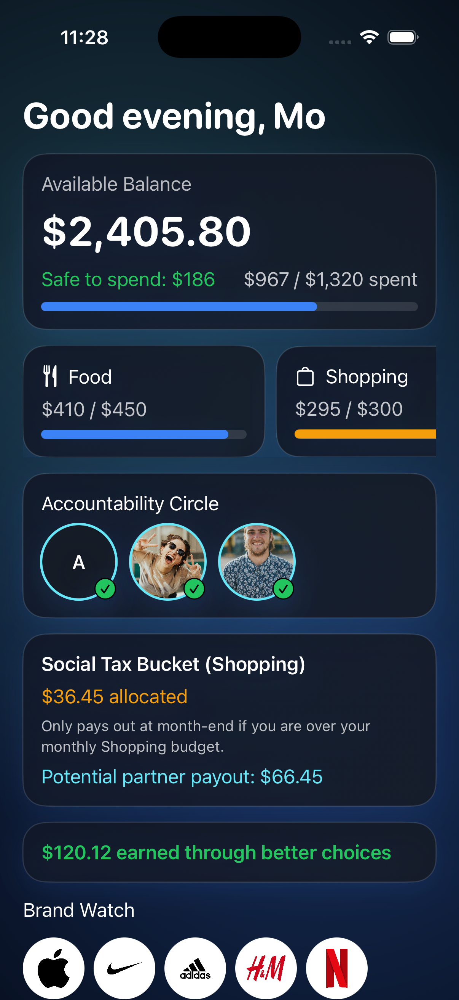
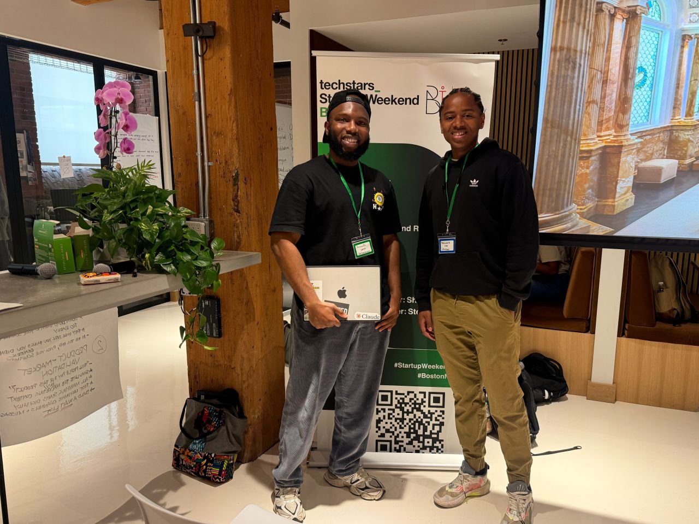

# Kommit

Kommit is an accountability banking prototype for Gen Z spenders who want to change impulse spending habits before the purchase happens.

Budgeting apps usually show you what went wrong after the money is gone. Kommit intervenes at the moment of temptation: when a spending category reaches its limit, the user has to pause, record a short video justification, and let an AI/accountability partner review the purchase before they continue.

## App Preview

  

## The Problem

Gen Z is living through inflation, a higher cost of living, and normalized debt through buy-now-pay-later products. At the same time, social media makes overconsumption feel constant and unavoidable.

The core issue is not awareness. Most people already know they are overspending. The hard part is the moment: the instant before a purchase when willpower is weakest and normal budgeting tools are silent.

## The Solution

Kommit replaces pure self-discipline with accountability, reflection, and social consequences.

When a user gets close to or passes a budget limit, Kommit creates a checkpoint:

1. The user records a short video explaining the purchase, their mood, and whether it is a want or a need.
2. AI reviews the purchase context and gives an accountability recommendation.
3. Friends or family can react as accountability partners.
4. If the user still pushes past the goal, a social tax pool can be paid out to their accountability circle.
5. Money saved through better choices is surfaced as progress and can eventually be routed toward savings or investing.

The insight: willpower does not work consistently. Social contracts do.

## Current Prototype

The current SwiftUI prototype includes:

- Onboarding for spending habits, triggers, and goals
- Initial self-reflection video flow
- Monthly budget setup with spending categories
- Alert thresholds before a user overspends
- Accountability partner selection, capped at three partners
- Mock Plaid-style account connection flow
- Dashboard with balance, safe-to-spend amount, category progress, and accountability circle
- Shopping social tax bucket with potential partner payout
- Purchase alert flow for an over-budget transaction
- Video justification screen using camera access when available
- AI review progress flow for budget, context, emotional trigger, and wants-vs-needs checks
- Partner reaction and response-video flow
- Saved-choice and earned-summary moments
- Brand watch section for merchants tied to spending behavior

## Why It Matters

Customer discovery showed that finance is intimate. People who admitted they struggled with impulse spending often did not want to be interviewed about it. That behavior shaped the product direction: Kommit should not shame users. It should create a private, reflective pause and give users control over what they share.

Kommit is designed for:

- College students and young adults building better money habits
- BNPL users trying to reduce debt
- Gen Z consumers who need more than a spending dashboard
- Parents, friends, or partners who want to help without monitoring everything

## Demo Flow

1. Set monthly budgets and spending buckets.
2. Pick accountability partners.
3. Link spending accounts through a Plaid-style flow.
4. Track spending against category limits.
5. Trigger a final warning when a category is near its cap.
6. Record a video justification for an over-budget purchase.
7. Let AI and partners review the purchase.
8. Save the money, or override and accept the accountability consequence.
9. Review money earned through better choices.

## Tech Stack

- SwiftUI
- AVFoundation camera preview
- Xcode iOS project
- Mock Plaid connection flow
- Prototype-ready AI review flow
- Future backend target: Supabase/Postgres or another API-backed data store
- Future financial integrations: Plaid, card transaction data, and savings/investing rails

## Hackathon Context

  

Kommit was built as a hackathon project focused on behavioral finance, Gen Z spending habits, and the emotional triggers behind impulse purchases.

## Roadmap

- Connect real bank data with Plaid
- Replace mock AI review with an actual model-backed accountability agent
- Add configurable privacy controls for what partners can see
- Build partner invitations and mobile notifications
- Define the social tax rules and compliant money movement flow
- Add savings and investing flows for money left over at month-end
- Test gamified savings challenges, streaks, and friend leaderboards

## Positioning

Mint, YNAB, and traditional budgeting apps are rearview mirrors. Kommit is the steering wheel. It helps users make a better decision before the purchase becomes regret.
